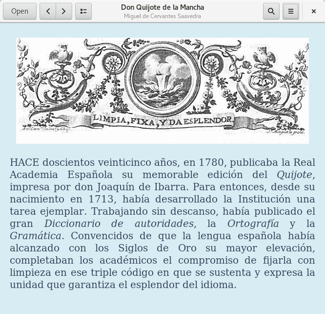
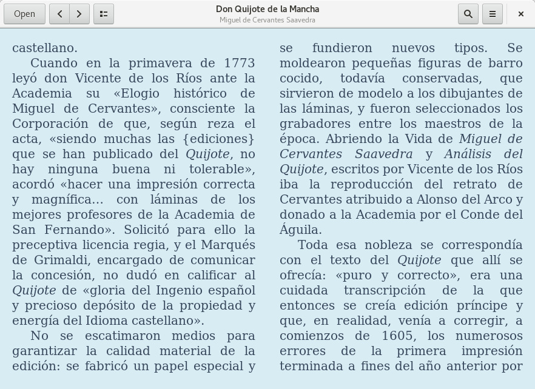

# Seneca (in development)

Seneca is an epub reader made to fit in GNOME.

## Screenshot




## Installation

Download the files, extract and then run the following inside the folder:

```
mkdir builddir
cd builddir
meson ..
ninja
sudo ninja install
```

To run:

```
seneca
```

## Requirements

For installation:
- gcc
- python3
- pygobject-3.0
- webkit2gtk-web-extension-4.0
- meson
- glib-compile-schemas

For running:
- python3
- python3-gobject
- python3-lxml
- webkit2gtk

## License

This software is under the GPLv3. See [COPYING](COPYING).
